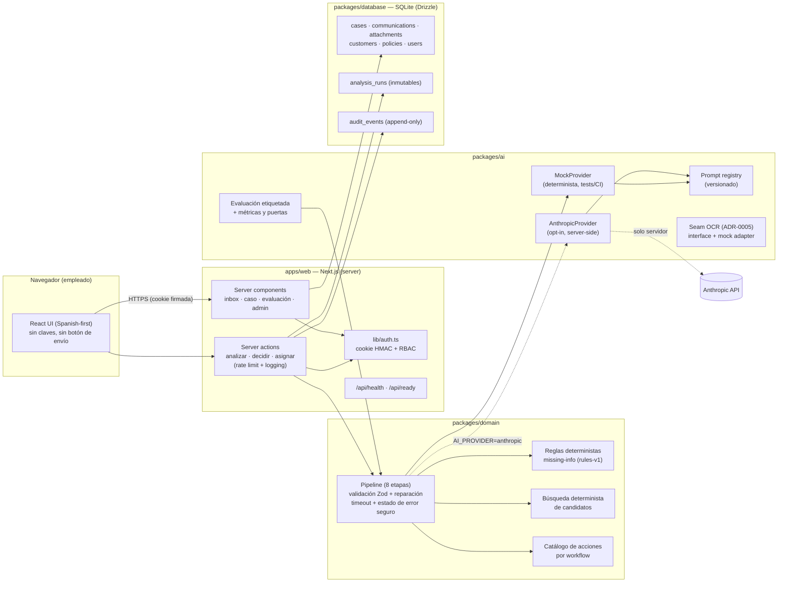
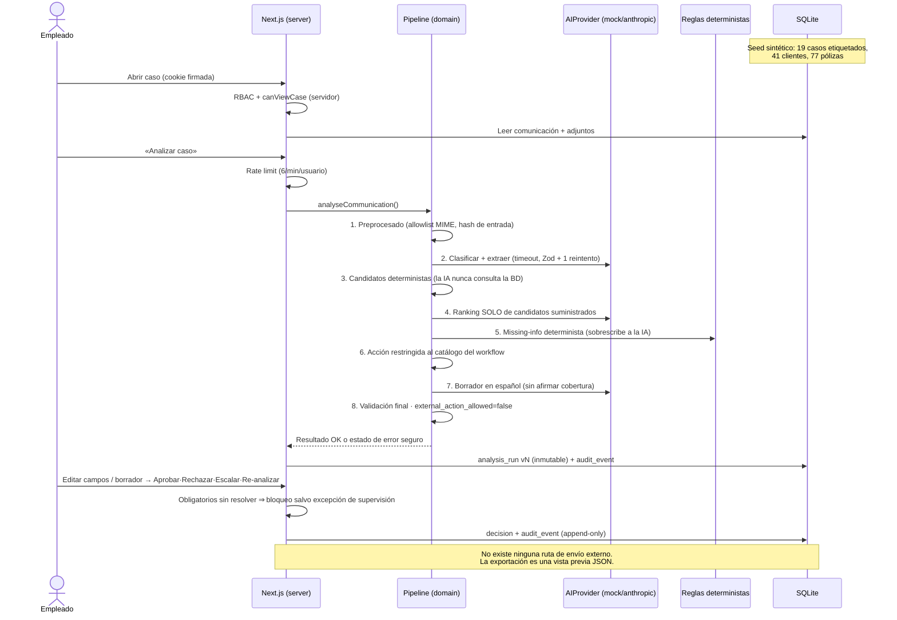

# Architecture — Rosillo Intake Copilot

## Component architecture

Package dependency rule: `domain` depends on nothing internal; `ai` and
`database` depend only on `domain`; `apps/web` composes all three. Prompts,
schemas, providers, deterministic rules, and UI never mix (spec §12).

## Data flow — one case, end to end

## Persistence model

- **SQLite via Drizzle** for the prototype (ADR-0002); portable SQL so the
  driver can swap to Postgres. Relative `DATABASE_PATH` resolves against the
  monorepo root so the web app and CLI share one file.
- **Immutability in the engine**: triggers abort `UPDATE` on `analysis_runs`
  and `UPDATE`/`DELETE` on `audit_events`; a CHECK constraint rejects any
  customer row not marked `SYNTHETIC`.
- Evidence and the suggested action live inside `analysis_runs.output_json` —
  the run is the immutable unit of record.

## Operational surfaces

- `/api/health` — liveness (no dependencies).
- `/api/ready` — DB migrated+seeded and provider constructible; reports
  degraded mode when Anthropic is configured without a key.
- Structured JSON logs on stdout (content redacted unless `LOG_CONTENT=1`).
- `npm run evaluate` — labelled evaluation with hard quality gates.
